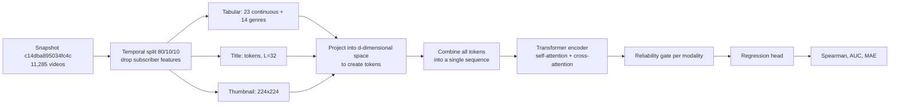

# Early Fusion (RATF) — Research Protocol

> **RATF** = _Reliability-Aware Token Fusion_: token-level early fusion for predicting the relative performance of YouTube videos from tabular metadata, titles, and thumbnails.
> This document is the single source of truth for the early-fusion experiments. All figures come from result files in the repository (`*_results.jsonl`, `stage*_full_best.json`, `final_cfg.json`, `summary_refit_*.json`).

**Branch:** `cleanup/m6-final` · **Dataset snapshot:** `c14dba895034fc4c`

> ⚠️ **Writing convention.** Sections marked **`TODO (verify in code)`** contain details not listed in the result files. Fill these in from the code in `early_fusion/` before considering this document final; do not fill them in from memory. The complete list is in Appendix A.

---

## 0. Executive Summary

| Item                                     | Nilai                                                                                                                            |
| ---------------------------------------- | -------------------------------------------------------------------------------------------------------------------------------- |
| Research question                        | Do token-level interactions between thumbnails, titles, and metadata (early fusion) outperform tuned late fusion?                |
| Evaluation protocol                      | Temporal 80/10/10 split, **without subscriber features** (`temporal_no_subs`)                                                    |
| Main baseline                            | **M3′** (tuned late fusion): test Spearman **0.2740 ± 0.0170** (3 seeds)                                                         |
| Final model                              | **M6 v2 granular**, `sigmoid2` gate, one configuration selected through 3-stage Optuna tuning                                    |
| Final results (train+val refit, 5 seeds) | test Spearman **0.3791 ± 0.0111** (seed average), **0.4313** (5-seed ensemble), ensemble AUC **0.6899**, ensemble MAE **0.4758** |
| Important note                           | The M6 refit vs. M3′ comparison is not yet _apples-to-apples_ (see §8.3)                                                         |

---

## 1. Dataset

### 1.1 Snapshot and Split

- Snapshot: `c14dba895034fc4c`, **N = 11,285** videos, **135 channels**.
- **Temporal** 80/10/10 split: train = **9,028**, val = **1,128**, test = **1,129**.
- Mode: `temporal_no_subs`, i.e. `drop_subs = true` (subscriber features are removed due to leakage risk).
- Split hashes (identical across all result files):

| Split | Hash               |
| ----- | ------------------ |
| train | `adb6377518e6233e` |
| val   | `1099f7a03511c7ea` |
| test  | `dccdabc759d22895` |

### 1.2 Channel Audit

- `channels.json`: 151 channels → **135 ingested**, 16 missing (verified via the API; see `missing_channels_audit.csv`).

| Category              | Count | Channel                                                                            |
| --------------------- | ----: | ---------------------------------------------------------------------------------- |
| `channel_not_found`   |     6 | @AlexG, @Empleman, @MaxMiller, @NikoOmilana, @ProHomeCooks, @TheEngineeringMindset |
| `no_videos_in_window` |     4 | @CompanyMan, @Hoog, @HowToMakeEverything, @LessonsFromTheScreenplay                |
| `all_shorts`          |     4 | @Garage54, @PracticalEngineering, @TomSka, @jasontheween                           |
| Unresolved errors     |     2 | @AdamRagusea (timeout), @Kraut (playlist 404)                                      |

**Conclusion:** no channels failed due to an ingestion bug; those 16 channels simply had no videos that passed the filters.

### 1.3 Text Token Length (L)

- Title-length distribution (11,285): p50 = 11, p90 = 19, p95 = 22, p99 = 29, max = 174.
- **L = 32** tokens → 0.59% of titles are truncated (≤ 1%), saving ~200 MB compared with L = 48.

### 1.4 Thumbnail Size Distribution

| Size            | Count | Percentage | Quality |
| --------------- | ----: | ---------: | ------- |
| 1280×720 (16:9) | 9,565 |      84.8% | maxres  |
| 640×480 (4:3)   | 1,710 |      15.2% | high    |
| 480×360 (4:3)   |    10 |       0.1% | medium  |

- Transform: `squash` to **224×224** (aspect ratio ignored), RGB mode.
- Note: ~15.3% of thumbnails are non-16:9, so the visual distortion caused by squashing differs.

### 1.5 Model Input Features

**Target (y)** — performance relative to the channel's own average:

```
target = log(1 + views) - log(1 + trailing_avg_views)
```

- `trailing_avg_views` = the average views of the previous 5 uploads on the same channel (a video never sees its own views). This definition follows the original repository's README; the code loads it via `compute_target(df["views"], df["trailing_avg_views"])` in `load_snapshot`.
- A target > 0 means the video performed better than its recent average. The binary label for **AUC** is `target > 0`.
- The target is on a log-ratio scale, so **target MAE** (log-ratio) and **view MAE/MAPE/RMSE** (after inverse transformation) are on two different scales.

**Model inputs:**

| Modality           | Shape                                                                  | Notes                                                                                                                                                                                   |
| ------------------ | ---------------------------------------------------------------------- | --------------------------------------------------------------------------------------------------------------------------------------------------------------------------------------- |
| Continuous tabular | **23**-dimensional vector (`n_cont = 23`)                              | `subscriber_count_at_upload` is **removed** (column index 0 of the tabular matrix); `trailing_avg_views` (log) **remains an input feature**; the scaler is fit on the training set only |
| Genre              | categorical index, **14** values (13 genres in training + 1 `unknown`) | categorical embedding                                                                                                                                                                   |
| Image              | **50 tokens × 768-d**                                                  | token cache (`data_snapshots/token_cache`)                                                                                                                                              |
| Text               | **32 tokens × 512-d** + padding mask                                   | L = 32 (see §1.3)                                                                                                                                                                       |

> ⚠️ **TODO (verify in code):** names of the 23 continuous features, contents of `features/target.py` (check whether it is identical to the original repository), and the token-cache generator (backbone, and whether the 50 tokens are 49 patches + CLS from CLIP ViT-B/32).

---

## 2. End-to-End Architecture and Mechanism

### 2.1 High-Level Flow



The core idea of early fusion: **all modalities are converted into tokens in the same space before interaction**, allowing attention to connect title/thumbnail tokens with metadata tokens. In contrast, late fusion (M3′) encodes each modality separately and combines them at the end.

### 2.2 Tokenization Variants (measured results)

| Variant      | Description                                               |      n_params |
| ------------ | --------------------------------------------------------- | ------------: |
| **Granular** | one token per patch/token for images and text             | **1,004,874** |
| **Pooled**   | images and text are compressed (pooled) into fewer tokens |   **994,378** |

The 10,496-parameter difference between the two variants comes from differences in token handling.

Constants in `m6_core.py` for granular v2: **`N_IMAGE_TOKENS = 50`** (dim 768), **`N_TEXT_TOKENS = 32`** (dim 512), **`NHEAD = 4`** (`d` must be divisible by 4), `dim_ff = d × ff_mult`. Embeddings are given Gaussian noise during training (`emb_noise`).

The `variant` values supported by the code are `full`, `no_image`, `no_text`, and `tab_only`. The final model uses **`full`**.

> ⚠️ **TODO (verify in `ratf_m6_granular_v2.py`):** how tabular and genre vectors are converted into tokens (how many tokens), special tokens (CLS/pooling), positional encoding, the order of self-attention and cross-attention, and how pooling reduces the number of tokens.

### 2.3 Encoder

Final architecture hyperparameters (`final_cfg.json`):

| Parameter                        | Value  |
| -------------------------------- | ------ |
| `d` (dimensi model)              | 192    |
| `num_layers`                     | 3      |
| `cross_attn_layers`              | 2      |
| `ff_mult`                        | 2      |
| `dropout`                        | 0.0789 |
| `emb_noise`                      | 0.1044 |
| `mod_dropout` (modality dropout) | 0.0869 |

- `emb_noise`: noise applied to embeddings during training (regularization).
- `mod_dropout`: entire modalities are randomly dropped during training so the model does not depend on a single modality.

> ⚠️ **TODO (verify in code):** whether `cross_attn_layers` is part of `num_layers` or consists of additional layers, and the direction of cross-attention (which modality serves as the query).

### 2.4 Reliability Gate

The gate assigns reliability weights to each modality (text, image, tabular) before fusion. Two modes were tested:

| Mode       | Values in sweep             | Notes                                   |
| ---------- | --------------------------- | --------------------------------------- |
| `softmax`  | modality dropout 0 and 0.15 | weights compete across modalities       |
| `sigmoid2` | modality dropout 0.15       | **selected** as the final configuration |

- `gate_lr_mult = 10` in all Optuna stages (the gate is trained with a learning rate 10× higher).
- **In the final refit, `gate_lr_mult = 0`** (tag `gateoff`); see §6.

In `train_one`, gate parameters are placed in their own _parameter group_ with `lr = lr × gate_lr_mult` and `weight_decay = 0`. Therefore, **`gate_lr_mult = 0` means the gate is frozen at initialization**: the gate remains in the forward pass, but its parameters are never updated. This does not mean the gate was removed.

> ⚠️ **TODO (verify in `ratf_m6_granular_v2.py`):** the `sigmoid2` / `softmax` formulas and how gate weights are applied (as multipliers for modality tokens, or otherwise).

### 2.5 Training

| Parameter             | Value                      |
| --------------------- | -------------------------- |
| Batch size            | 64                         |
| LR / weight decay     | 2.787e-4 / 0.01674         |
| Schedule              | `const` (warmup 0.7 epoch) |
| Grad clip             | 1.0                        |
| Max epochs / patience | 60 / 15                    |
| EMA                   | 0.0 (disabled)             |
| `rank_lambda`         | 0.0 (no rank loss)         |

- **Loss:** `nn.HuberLoss()` on the log-ratio target (`rank_lambda = 0`, so the additional rank loss is inactive).
- **Optimizer:** AdamW; the gate has its own parameter group (see §2.4).
- **`fit = train` protocol with `const` schedule** (used for sweeps and Optuna): select the epoch with the best **validation Huber loss**, use `patience = 15`, then load the best epoch's weights (`protocol = early_stop`).
- **`fit = trainval` protocol** (production refit): train on train+val for a **fixed number of epochs** (`--refit-epochs`, required for the `const` schedule), without validation or early stopping, using the final weights (`protocol = final`). The scaler and genre list are still fit on the **training set only**.

---

## 3. Baseline: M3′ (Tuned Late Fusion)

Late fusion with **40,865 parameters**, AdamW, LR 1e-3, weight decay 1e-4, batch size 64, 5% warmup, gradient clipping 1.0, and up to 400 epochs. Seeds 42–44, mode `temporal_no_subs`.

|                Seed | Validation Spearman |       Test Spearman |            Test AUC |          Target MAE |             View MAE |           View MAPE |               View RMSE | Best epoch |
| ------------------: | ------------------: | ------------------: | ------------------: | ------------------: | -------------------: | ------------------: | ----------------------: | ---------: |
|                  42 |              0.3228 |              0.2853 |              0.6220 |              0.4978 |              631,069 |              0.5797 |               2,431,447 |          7 |
|                  43 |              0.3117 |              0.2822 |              0.6261 |              0.4990 |              599,817 |              0.5939 |               2,138,652 |          6 |
|                  44 |              0.2846 |              0.2545 |              0.6106 |              0.5050 |              613,970 |              0.5370 |               2,247,855 |          6 |
| **Rata-rata ± std** | **0.3064 ± 0.0197** | **0.2740 ± 0.0170** | **0.6196 ± 0.0080** | **0.5006 ± 0.0038** | **614,952 ± 15,649** | **0.5702 ± 0.0296** | **2,272,651 ± 147,964** |            |

_(std = sample standard deviation, ddof = 1.)_

> **Original repository context (`avalon-py/yt-performance-predictor`).** Its README reports late fusion v1 (frozen CLIP, LR 2e-5, **with** subscriber count, chronological 80/10/10 split, **1,060** test rows, and a different data snapshot) with test Spearman of 0.30–0.33. The target definition is the same as in §1.5. However, those figures are **not a direct comparison**: the dataset, number of test rows, subscriber features, and LR differ. The official comparator in this document is M3′ on the same snapshot as M6. The same README also notes that `subscriber_count_at_upload` is actually the subscriber count **at present**, not when the video was published, supporting the decision to remove that feature.

> **The old M3′ result (test 0.3533) and all M0/M0b/M3/M4 baselines have been removed from this document.** Those figures came from a protocol predating `temporal_no_subs` and are not comparable with the results above. Only the figures in the table in §3 are valid.

---

## 4. M6 v2 Experiments: Granular vs. Pooled

All runs: `temporal_no_subs` split, `cross_attn_layers = 1`, **validation only evaluated** (`test_eval = false`). The test set was accessed only at the final stage.

### 4.1 Granular (1,004,874 parameters)

| Config                | Seed 42 | Seed 43 |    Seed 44 | **Validation Spearman (mean ± std)** | Mean validation AUC | Best epoch  |
| --------------------- | ------: | ------: | ---------: | -----------------------------------: | ------------------: | ----------- |
| softmax, md 0         |  0.3211 |  0.3146 | **0.2374** |                      0.2910 ± 0.0466 |              0.6186 | 9 / 7 / 3   |
| softmax, md 0.15      |  0.3113 |  0.3192 |     0.3173 |                      0.3159 ± 0.0041 |              0.6344 | 11 / 7 / 12 |
| **sigmoid2, md 0.15** |  0.3148 |  0.3240 |     0.3221 |                  **0.3203 ± 0.0048** |          **0.6363** | 11 / 7 / 12 |

### 4.2 Pooled (994,378 parameters)

| Config            | Seed 42 | Seed 43 | Seed 44 | **Validation Spearman (mean ± std)** | Mean validation AUC | Best epoch |
| ----------------- | ------: | ------: | ------: | -----------------------------------: | ------------------: | ---------- |
| sigmoid2, md 0.15 |  0.3228 |  0.2821 |  0.3013 |                      0.3021 ± 0.0204 |              0.6279 | 5 / 5 / 6  |
| softmax, md 0.15  |  0.3225 |  0.2825 |  0.3053 |                      0.3035 ± 0.0201 |              0.6283 | 5 / 5 / 6  |

### 4.3 Findings

1. **Modality dropout stabilizes training.** Without modality dropout (md 0), seed 44 collapsed to 0.2374 and stopped at epoch 3. With md 0.15, all three seeds were in the 0.311–0.324 range (std decreased from 0.0466 to ~0.004).
2. **Granular performs better and is much more stable than pooled.** Validation: 0.3203 ± 0.0048 vs. 0.3021 ± 0.0204. Pooled stopped very early (epochs 5–6), and variation across seeds was ~4× larger.
3. **`sigmoid2` is slightly better than `softmax`** on granular (0.3203 vs. 0.3159), but the 0.0044 difference is still within one standard deviation, so it **cannot yet be considered significant**. For pooled, the two are practically identical.
4. **The gate is inconsistent across seeds.** Average gate weights per modality vary (e.g., granular `sigmoid2` image gate: 1.25 / 1.40 / 1.95 for seeds 42 / 43 / 44, with per-sample std of only 0.02–0.10, nearly constant). This **must not** be interpreted as evidence that a modality is "more important"; interpreting the gate as an explanation requires separate verification (e.g., through modality ablation).
5. **The validation advantage over M3′ is small.** Best M6 granular validation score: 0.3203 vs. M3′ 0.3064 (difference +0.014, equivalent to < 1 M3′ standard deviation of 0.0197).

---

## 5. Hyperparameter Search (Optuna, 3 Stages)

Procedure: explore ~30 TPE trials (objective = mean validation Spearman across 2 seeds: 42 and 43) → confirm the top 3 on seeds 42–44 → evaluate one final configuration on seeds 100–104 with `--eval-test` once.

| Parameter                                     |                    Stage A |  Stage B | Stage C (= `final_cfg.json`) |
| --------------------------------------------- | -------------------------: | -------: | ---------------------------: |
| `d`                                           |                        128 |      192 |                          192 |
| `num_layers`                                  |                          2 |        3 |                            3 |
| `cross_attn_layers`                           |                          1 |        2 |                            2 |
| `ff_mult`                                     |                          4 |        2 |                            2 |
| `dropout`                                     |                     0.1177 |   0.1177 |                   **0.0789** |
| `emb_noise`                                   |                     0.0774 |   0.0774 |                   **0.1044** |
| `mod_dropout`                                 |                     0.1214 |   0.1214 |                   **0.0869** |
| `lr`                                          |                   2.255e-4 | 2.255e-4 |                 **2.787e-4** |
| `weight_decay`                                |                    0.00737 |  0.00737 |                  **0.01674** |
| `gate_mode` / `gate_dropout` / `gate_lr_mult` |        sigmoid2 / 0.1 / 10 |     sama |                         sama |
| batch / clip / schedule / epochs / patience   | 64 / 1.0 / const / 60 / 15 |     sama |                         sama |

**How to read this:**

- **A → B:** only the **architecture** changes (wider, deeper, 2 cross-attention layers, smaller FF); regularization and LR are inherited from A.
- **B → C:** the architecture is locked; **regularization and optimization** are tuned (lower dropout, noise, and modality dropout; higher LR and weight decay).
- `final_cfg.json` is identical to `stageC_full_best.json`.

> ⚠️ **TODO (verify from the Optuna logs):** validation scores per stage/trial are not present in the attached files (only the best configurations are available). Add a score table if you want to show progress from A → B → C.

---

## 6. Final Configuration and Results (Refit)

**Tag:** `refit_m6_c24_gateoff` · **cfg_hash:** `ea9eafc5d2062447` · **variant:** `full` · **fit:** `trainval` · **seed:** 100, 101, 102, 103, 104.

The refit configuration is the same as `final_cfg.json` **except for one field**: `gate_lr_mult = 0` (it was 10 in Optuna). This means the configuration evaluated on the test set is the **gate-off** variant, not exactly the configuration selected by Optuna.

### 6.1 Test Metrics

| Metric                             |      Value |
| ---------------------------------- | ---------: |
| Test Spearman, rata-rata 5 seed    | **0.3791** |
| Test Spearman, std antar seed      |     0.0111 |
| **Test Spearman, ensemble 5 seed** | **0.4313** |
| Test AUC, ensemble                 |     0.6899 |
| Test MAE (target), ensemble        |     0.4758 |

- **Seed average** = the expected performance of a single model.
- **Ensemble** = predictions from five models (seeds 100–104) are averaged and then evaluated once. The ensemble score is higher because averaging predictions reduces variance across seeds.

> The `MAE views`, `MAPE views`, and `RMSE views` metrics are **not recorded** in the refit file (they are available only for M3′).
> **Metric definitions** (the `metrics` function in `m6_core.py`):

| Metric   | Definition                                                                                     |
| -------- | ---------------------------------------------------------------------------------------------- |
| Spearman | rank correlation between predictions and the target                                            |
| AUC      | `roc_auc_score(target > 0, predictions)`                                                       |
| MAE      | mean absolute error on the **target scale (log-ratio)**, comparable to M3′'s `test_mae_target` |

**Ensemble** = the average of the **raw predictions** (on the target scale) from 5 seeds, after which metrics are calculated once on the averaged predictions.

**Refit protocol:** `fit = trainval`, `const` schedule, fixed number of epochs (the `c24` tag suggests 24 epochs; verify the `refit_epochs` field in `m6_final_runs.jsonl`), without validation.

---

## 7. Final Comparison

| Model                                 | Fit           | Seeds   | Validation Spearman |   **Test Spearman** |      Test AUC | Test MAE (target) |
| ------------------------------------- | ------------- | ------- | ------------------: | ------------------: | ------------: | ----------------: |
| M3′ (late fusion)                     | train         | 42–44   |     0.3064 ± 0.0197 | **0.2740 ± 0.0170** |        0.6196 |            0.5006 |
| M6 granular (Optuna, validation-only) | train         | 42–44   |     0.3203 ± 0.0048 |       not evaluated | not evaluated |     not evaluated |
| **M6 refit (gate-off)**, seed average | **train+val** | 100–104 |                 n/a | **0.3791 ± 0.0111** |           n/a |               n/a |
| **M6 refit (gate-off)**, ensemble     | **train+val** | 100–104 |                 n/a |          **0.4313** |    **0.6899** |        **0.4758** |

Raw difference: M6 refit seed average vs. M3′ = **+0.105** Spearman; target MAE 0.4758 vs. 0.5006.

---

## 8. Limitations and Caveats

1. **Only one temporal split.** The standard deviations above reflect only seed variation, not variation in the selected data period.
2. **The test set was used sparingly.** All sweeps used validation; the test set was used only at the final stage (`test_eval = false` for all sweep runs). This is correct practice and should be maintained. The code also uses a **test-guard ledger** (`results/test_eval_ledger.jsonl`): each `--test-role` can access the test set for only one configuration (cfg+variant+fit hash), preventing the test set from being "peeked at and then tuned against."
3. **The comparison is not yet apples-to-apples.**
   - M6 final is _refit_ on **train+val**, whereas M3′ is trained on **train only**. M6 has ~12% more training data.
   - The seed sets differ (100–104 vs. 42–44).
   - The ensemble metric (0.4313) **must not** be compared with the M3′ seed average (0.2740). The comparable baseline is the _M3′ ensemble_.
   - **Recommendation:** refit M3′ on train+val with seeds 100–104 and report both the seed average and ensemble performance.
4. **The refit configuration ≠ the Optuna configuration** in one field (`gate_lr_mult`). Explain why gate-off was selected, and ideally include validation results comparing gate-on vs. gate-off. ⚠️ The rationale and evidence for this decision are not present in the attached files.
5. **The validation advantage over M3′ is small** (§4.3, item 5); most of the large test-score difference cannot yet be separated from the effect of additional training data (item 3).
6. **Run provenance.** The sweep and M3′ logs record `git_sha = f4c8ef7f…` with `git_dirty = true`, so the code was not clean at the time. Ensure the code in `cleanup/m6-final` produces the same results before making reproducibility claims.
7. **Gate interpretation** has not been validated (§4.3, item 4).

---

## 9. Reproducibility

| Item                  | Nilai                                                                     |
| --------------------- | ------------------------------------------------------------------------- |
| Snapshot              | `c14dba895034fc4c`                                                        |
| Hash split            | train `adb6377518e6233e`, val `1099f7a03511c7ea`, test `dccdabc759d22895` |
| Seed M3′ / sweep M6   | 42, 43, 44                                                                |
| Seed refit final      | 100, 101, 102, 103, 104                                                   |
| cfg_hash refit        | `ea9eafc5d2062447`                                                        |
| Git SHA run sweep/M3′ | `f4c8ef7f84a1d6f3312da1726b098947e8d9f780` (`git_dirty = true`)           |
| Hardware              | GPU (CUDA)                                                                |

### Result files used as sources for the reported figures

| File                                   | Contents                              |
| -------------------------------------- | ------------------------------------- |
| `m3_prime_results.jsonl`               | M3′, 3 seed, val + test               |
| `m6v2_temporal_granular_results.jsonl` | sweep granular (9 run)                |
| `m6v2_temporal_pooled_results.jsonl`   | sweep pooled (6 run)                  |
| `stageA/B/C_full_best.json`            | konfigurasi terbaik tiap tahap Optuna |
| `final_cfg.json`                       | konfigurasi final (= Stage C)         |
| `summary_refit_m6_c24_gateoff.json`    | hasil refit final                     |

---

## Appendix A. TODO Checklist (fill in from code, not from memory)

**Already answered from the code:** target definition and AUC label · loss and optimizer · early-stopping vs. refit protocol · ensemble definition · meaning of `gate_lr_mult = 0` · number of image/text tokens · metric definitions.

**Still open:**

- [ ] Verify that `features/target.py` is identical to the original repository (`git diff upstream/main -- features/target.py`)
- [ ] Names of the 23 continuous features
- [ ] Token-cache generator: backbone and origin of the 50 image tokens
- [ ] `ratf_m6_granular_v2.py`: tabular/genre tokenization, self-/cross-attention order, gate formula, positional encoding
- [ ] How the pooled variant reduces tokens
- [ ] Value of `refit_epochs` in the final refit (check `m6_final_runs.jsonl`)
- [ ] Validation scores for each Optuna stage (A, B, C)
- [ ] Reason for selecting gate-off for refit
- [ ] Whether a final **train-only** run exists (`summary_final_m6.json`), which would be the fairest comparator against M3′
- [ ] Whether refit predictions are saved (`results/preds/refit_m6*_seed*.npz`) to calculate view-count metrics
